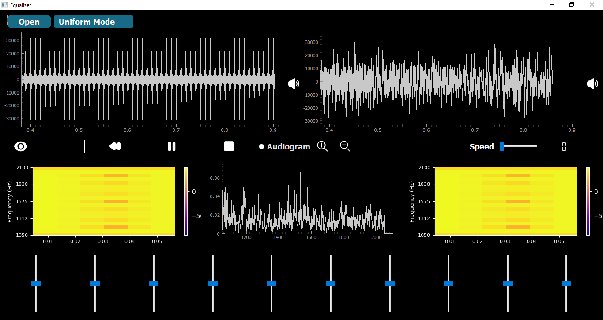
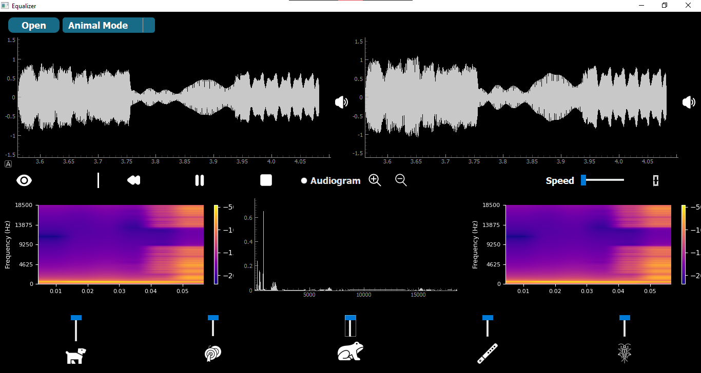
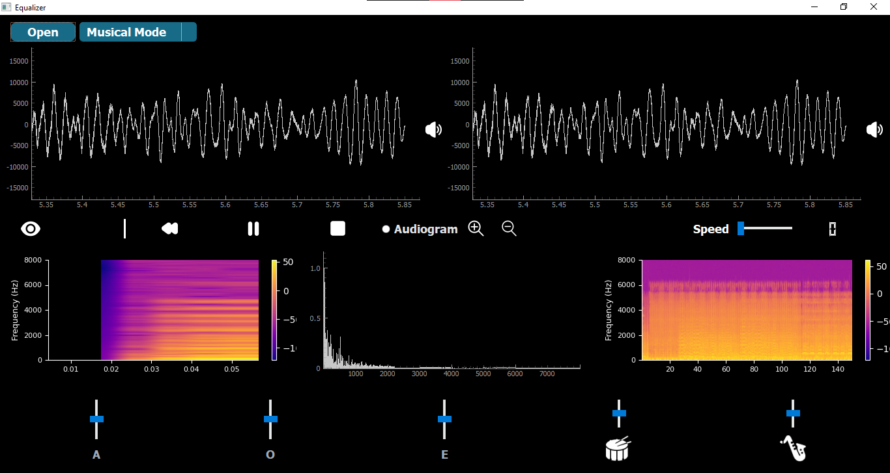
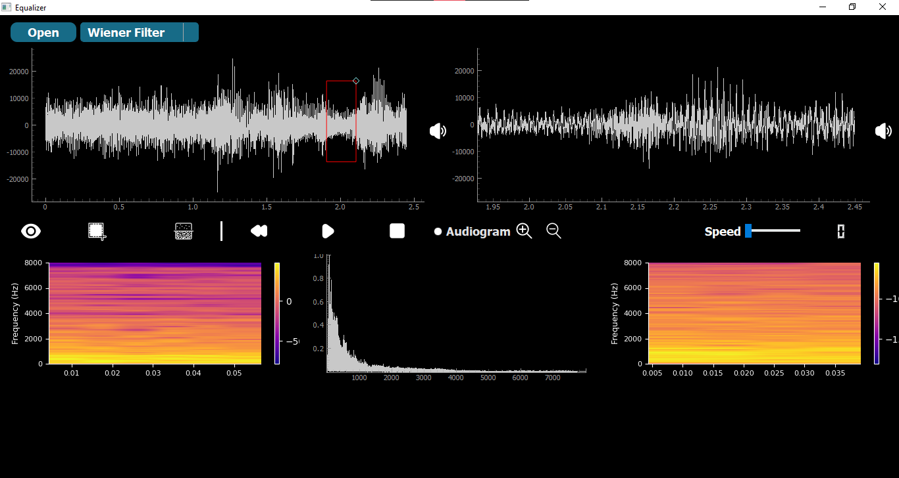

# Signal Equalizer

## Introduction
Signal Equalizer is a desktop application designed for manipulating frequency components of signals. It has applications in music, speech processing, and biomedical fields, such as noise suppression or feature enhancement.

---

## Features
- **Uniform Range Mode**: Divides the signal's total frequency range into 10 equal sections, each controlled by a slider.
- **Animal Sounds & Musical Instruments Mode**: Sliders control magnitudes of specific instrument and animal sounds within a mixed signal.
- **Musical Instruments & Vowels Mode**: Sliders manipulate musical instruments and vowel components in an input audio signal.
- **Wiener Filter Mode**: Apply a Wiener filter for noise suppression or signal restoration.
- **Dual Linked Cine Viewers**: Linked input and output signal viewers, synchronized for time and zoom operations.
- **Spectrogram Display**: Shows spectrograms of the input and output signals, which dynamically update with slider adjustments.
- **Audiogram & Linear Scale Views**: Fourier transform graph supports linear and audiogram scaling, switchable in the UI.
- **Responsive User Interface**: Sliders and controls adjust seamlessly when switching modes.

---

## Modes
### 1. Uniform Range Mode
- Divides the frequency spectrum of the signal into 10 equal ranges.
- Each range is manipulated independently using a slider.

 

### 2. Musical Instruments & Animal Sounds Mode
- Control both specific musical instrument and animal sound components in a composite audio signal.

 

### 3. Musical Instruments & Vowels Mode
- Modify the magnitude of musical instruments and vowel sounds present in the signal.
- Each slider can correspond to multiple frequency windows.


 
### 4. Wiener Filter Mode
- Implement noise suppression or signal restoration.
- Select noisy segment from original signal then apply filter to remove noise.


---

## Visualization
- **Linked Cine Viewers**: Simultaneously view input and output signals with play, pause, zoom, pan, and reset functionalities.
- **Dynamic Spectrograms**: Toggle spectrogram views for visualizing frequency magnitude changes.
- **Fourier Transform Graph**: Switch between linear and audiogram scales.

### DEMO


---

## How to Run
1. Clone this repository:
   ```bash
   git clone <repository_url>
   ```
2. Install dependencies:
   ```bash
   pip install -r requirements.txt
   ```
3. Run the application:
   ```bash
   python main.py
   ```

---

## Usage
1. Open a signal file.
2. Select a mode from the dropdown menu.
3. Use the sliders to adjust frequency components.
4. View changes in real-time through the cine viewers and spectrograms.

---

## Contributors

[Yasmine Mahmoud](https://github.com/yasmine-msg79)

[Eman Abdelazeem](https://github.com/Emaaanabdelazeemm)

[Hassnaa Hossam](https://github.com/hassnaa11)

[Ayat Tarek](https://github.com/Ayat-Tarek)

[Shahd Ahmed Ragab](https://github.com/shahdragab89)


